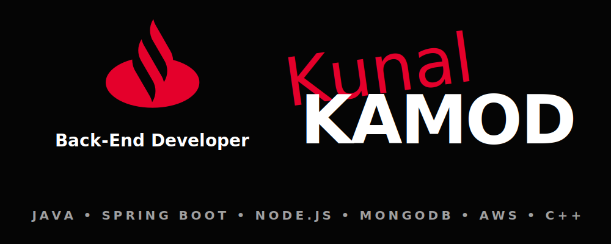

### Hey mate, Welcome to my World! 
📚 I'm a passionate Back-End Developer who loves building scalable web applications. My objective is to gain extensive experience in software engineering and continue leveling up my skills. 
🌱 I’m currently focused on Back-End Development with Node.js, Express, JavaScript, and building robust systems with MongoDB, MySQL, and AWS. 
🚀💻 I actively solve Data Structures and Algorithms problems in C++ to keep my problem-solving skills sharp! ♨️

## 📞 Do you want to talk with me?
 
 

# 👀 What am I studying/using now?:

> Back-End Web Development (Node.js/JavaScript)  
> Cloud & Containers (AWS, Docker, Kubernetes)  
> Architecture & Workflow (Microservices, Jira)  
> C++ (LeetCode / DSA)  

# 🛠️ Tools:

# 👁️ Profile Visitors

  

# ✍️ Random Dev Quote

